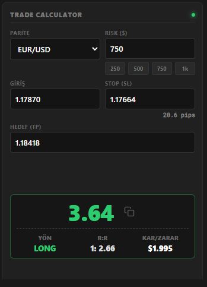
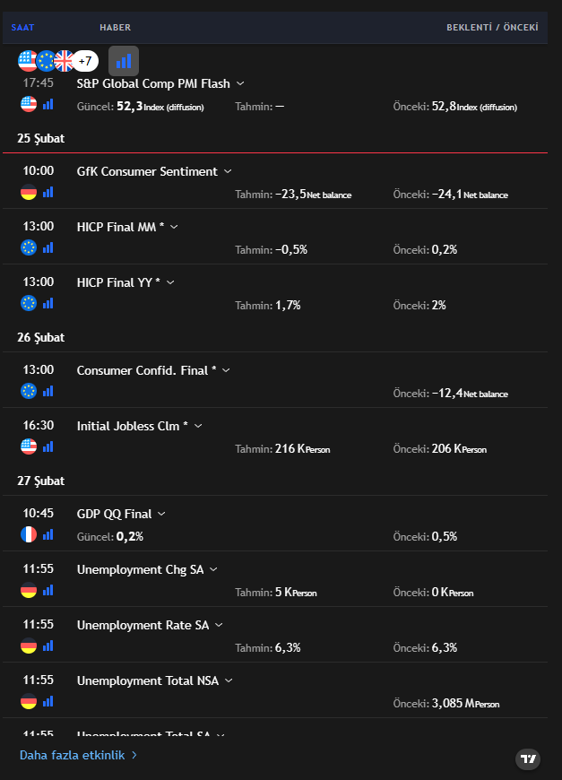
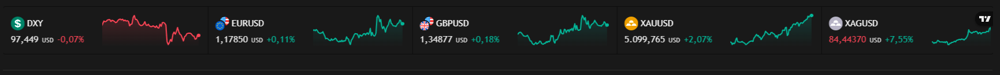

# TDD Trade Günlüğü - Notion Araçları

Bu depo, TDD Trade Günlüğü için tasarlanmıştır. 
**TDD Trade Günlüğü**, trader'ların işlemlerini, stratejilerini, psikolojilerini ve risk yönetimlerini tek bir merkezden profesyonelce takip edebilmeleri için hazırlanmış kapsamlı bir Notion şablonudur. Sadece bir kayıt defteri değil, aynı zamanda hatalarınızı görmenizi ve gelişiminizi takip etmenizi sağlayan bir analiz merkezidir.

**[TDD Trade Günlüğü Şablonunu İncelemek ve Edinmek İçin Tıklayın](https://tdd-tradegunlugu.notion.site/dashboard)**

> *Bu depodaki eklentiler, TDD Trade Günlüğü'nün içerisine gömülü (embed) olarak çalışması ve günlüğünüzü pratik kullanım sağlaması amacıyla Gemini kullanılarak kodlanmıştır.*

---

## İçindekiler
- [Hızlı Kullanım (TDD Günlüğü Kullanıcıları İçin)](#hızlı-kullanım-tdd-günlüğü-kullanıcıları-için)
- [Kişisel Kullanım ve Başka Sayfalara Ekleme](#kişisel-kullanım-ve-başka-sayfalara-ekleme)
- [İçerikteki Araçlar](#içerikteki-araçlar)
- [Kendi Reponuza Ekleme ve Özelleştirme](#kendi-reponuza-ekleme-ve-özelleştirme)
  - [Kendi GitHub Pages Bağlantınızı Oluşturma](#kendi-github-pages-bağlantınızı-oluşturma)
  - [Araçları Kişiselleştirme İpuçları](#araçları-kişiselleştirme-ipuçları)

---

## Hızlı Kullanım (TDD Günlüğü Kullanıcıları İçin)

Eğer **TDD Trade Günlüğü** şablonunu kullanacaksınız, bu depodaki tüm araçlar şablonunuzun içerisine **varsayılan olarak entegre edilmiş durumdadır**. Herhangi bir kurulum, link kopyalama veya ayar yapmanıza gerek yoktur. Şablonu hesabınıza kopyaladığınız anda tüm widget'lar çalışmaya başlar!

---

## Kişisel Kullanım ve Başka Sayfalara Ekleme

Eğer araçları günlüğünüzden yanlışlıkla sildiyseniz, başka kişisel Notion sayfalarınıza da eklemek isterseniz veya şablondan bağımsız olarak kullanmak isterseniz aşağıdaki adımları izleyebilirsiniz:

1. Araçların ana kontrol paneline gidin: **[traderyecair.github.io/notion-tools/](https://traderyecair.github.io/notion-tools/)**
2. İhtiyacınız olan aracın yanındaki **Kopyala** butonuna tıklayın.
3. Eklemek istediğiniz Notion sayfasına gidin, kopyaladığınız linki yapıştırın ve açılan menüden **"Create embed"** seçeneğine tıklayın.
4. Çıkan widget'ın köşelerinden çekerek boyutunu sayfanıza göre ayarlayın.

---

### **Trade Calculator (`lotsize.html`)**
> İşlem alırken riskinizi ($), giriş, stop ve hedef seviyelerinizi girerek ne kadarlık lot büyüklüğü almanız gerektiğini, kar/zarar oranınızı (R:R) anında hesaplayan araç.
>
> 

### **News Calendar (`news.html`)**
> Piyasa haberlerini ve ekonomik takvimi, beklenti ve önceki verilerle birlikte gösteren TradingView tabanlı widget.
>
> 

### **Market Sessions (`sessions.html`)**
> Sydney, Tokyo, Londra ve New York piyasalarının ne zaman açılıp kapanacağını gösteren seans takipçisi. Hafta sonu kapalılık durumu ve ABD/Avrupa Yaz Saati (DST) uygulamalarına göre otomatik güncellenir.
>
> 

### **Ticker Tape (`ticker.html`)**
> Seçili paritelerin, endekslerin veya kripto paraların canlı fiyatlarını ekranda kayan bir bant şeklinde gösteren TradingView eklentisi.
>
> 

### **Tool Hub (`index.html`)**
> Tüm araçların Notion "Embed" linklerini tek tıkla kopyalamanızı sağlayan ana kontrol sayfası.

---

## Kendi Reponuza Ekleme ve Özelleştirme

Eğer bu araçlardaki sembolleri, işlem paritelerini, renkleri veya özellikleri değiştirmek istiyorsanız projeyi kendi GitHub hesabınıza kopyalayarak (Fork) tamamen size özel hale getirebilirsiniz.

### Kendi GitHub Pages Bağlantınızı Oluşturma

Projeyi forklayıp GitHub deponuzun **Settings > Pages** sekmesinden yayınladığınızda, sistem URL yapınızı otomatik olarak algılar. `index.html` (Tool Hub) dosyası kök dizininizi okur; yani linkler bölümünü manuel olarak güncellemenize gerek yoktur. Ana sayfadaki kopyalama butonları otomatik olarak sizin deponuzdaki dosyaların (örneğin: `https://kullanici-adiniz.github.io/repo-adiniz/lotsize.html`) linklerini kopyalayacaktır.

### Araçları Kişiselleştirme İpuçları

* **`lotsize.html` (Hesap Makinesi):** İşlem yaptığınız farklı pariteler veya kripto paralar varsa, HTML içindeki `<select id="parity">` menüsüne yeni `<option>` etiketleri ekleyebilir ve JavaScript'teki `if (parity === '...')` döngülerine kendi sözleşme (contract) büyüklüklerinizi tanımlayabilirsiniz.
* **`ticker.html` (Kayan Bant):** `symbols=` parametresinin içerisindeki parite isimlerini (örneğin: `BINANCE:BTCUSDT`, `OANDA:EURUSD`) TradingView'daki sembol kodlarıyla değiştirerek bandı sadece kendi ilgilendiğiniz coin veya hisselere göre ayarlayabilirsiniz.
* **`news.html` (Haberler):** Ekranın altındaki `<script>` içerisinde bulunan `currencyFilter` (para birimleri) veya `countryFilter` (ülkeler) alanlarını düzenleyerek gereksiz veri kalabalığından kurtulup sadece ilgilendiğiniz ülkelerin ekonomik takvimini filtreleyebilirsiniz.

---

*Bu TDD Trade Günlüğü **yecair** tarafından yapılmıştır. Beni takip etmek isterseniz X hesabım: **[x.com/traderyecair](https://x.com/traderyecair)***

